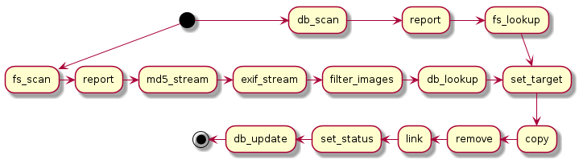

# Image Organizer [](https://travis-ci.org/AGrzes/image-organizer) [](https://coveralls.io/github/AGrzes/image-organizer?branch=develop)
Simple tool for for image indexing and organization.

The program scans the filesystem for image files and stores information about found images in CouchDB database. It identifies duplicate images using md5 sum and groups them together.

It can also 
* Copy files to target directory, organized by image creation date
* Remove source file - provided copy exist
* Place a link to target directory in place where source file was

## WARNING
This is still work in progress, use  at own risk.

## Dependencies
Image organizer requires [exiftool](http://www.sno.phy.queensu.ca/~phil/exiftool/) to analyze images.

## Usage
Install
```
npm install -g image-organizer
```

Run 

```
image-organizer <parameters>
```
### Parameters
| Short | Long | Type | Default | Description |
| --- | --- | --- | --- | --- |
| -a | --address | url | - | Database URL |
| -c | --copy | flag | false | Copy documents to destination |
| -r | --remove | flag | false | Remove Source Files |
|-l | --links | flag | false |  Create Source Links |
|-u | --update | flag | false | Update mode |
|-x | --skip-scan | flag | false | Disable Scan Mode |
|-t | --target | path | - | Target directory |
| -p | --paths | glob[] | - | Paths to scan |
| -m | --mime | pattern[] | ['image/**] | Mime types of files to process |
|-v | --verbose | flag* | 0 | Verbosity mode |

## Design
The image organizer is constructed from series of simple streams which process file records in turn.


### db_scan
Fetches documents matching supplied path from CouchDB and emits one message per matching file. Step enabled by update mode.
### report
Prints path of the processed file. Enabled on verbosity 1 and greater.
### fs_lookup
Checks if file is still present on the disk and if it is a symlink. 
### fs_scan
Lists files matching supplied path. Step enabled by scan mode.
### md5_stream
Calculates md5sum of file.
### exif_stream
Determines exif data of file using `exiftool`.
### filter_images
Rejects files not matching specified mime types.
### db_lookup
Looks for file in CouchDB by md5sum. If not found initializes new document. 
### set_target
Calculates target file location using creation date and original file name.
### copy
Copies file to the target location. Acts only if source file exist and target file does not exist. Step enabled by copy flag.
### remove
Removes source file. Acts only if source file exist and target file exist. Step enabled by remove flag.
### link
Creates link to target file in original location. Acts only if source file does not exist and target file exist. Step enabled by link flag.
### set_status
Updates file status in document.
### db_update
Updates document in CouchDB. In case of conflict merges changes.
